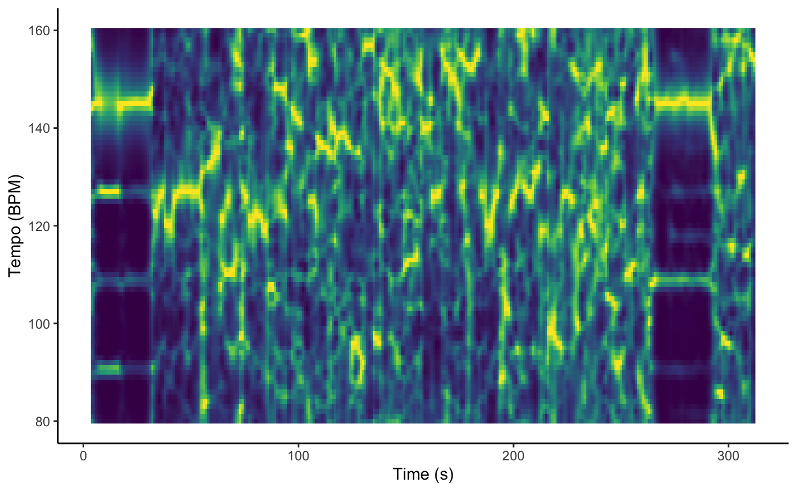
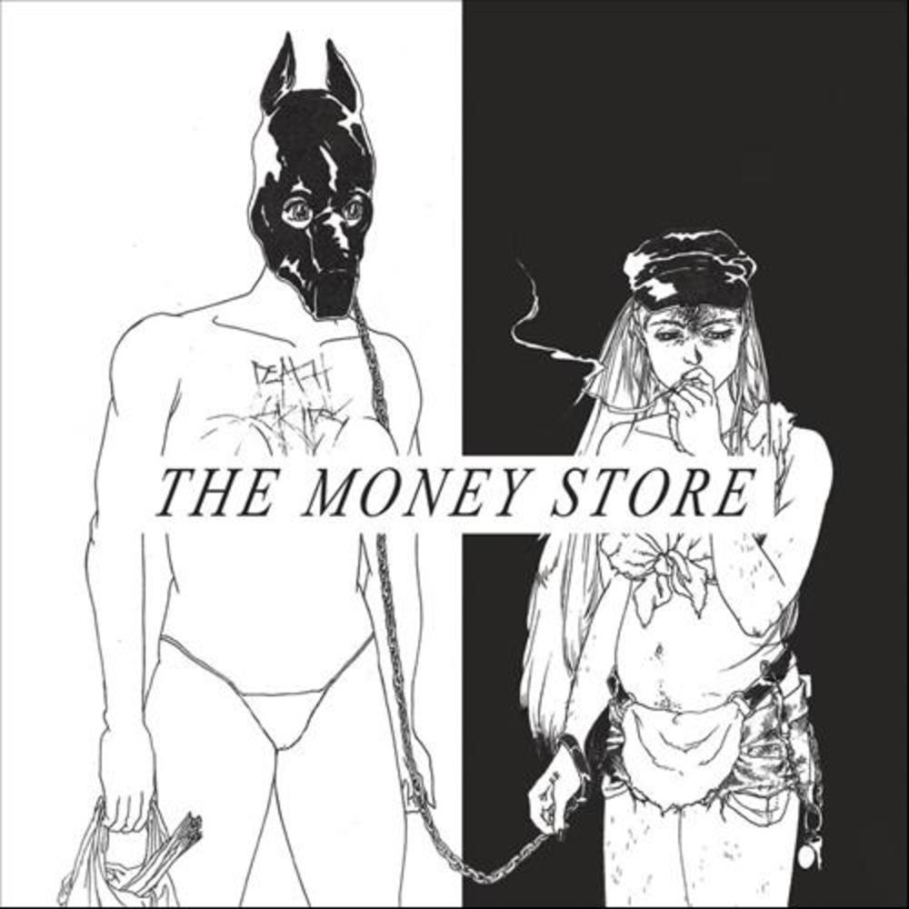

<style>                   
.navbar {
  background-color: #E77F17
}
.navbar-brand {
color:black!important;
}
</style> 


```{r setup, include=FALSE}
library(flexdashboard)
library(plotly)
library(spotifyr)
library(tidyverse)
library(ggplot2)
library(compmus)
library(tidymodels)
library(heatmaply)
library(ggdendro)
library(purrr)
library(cowplot)
library(dplyr)
library(viridis)
library(hrbrthemes)
library(d3heatmap)
library(dendextend)
library(shiny)
library(fontawesome)
```

``` {r load_packages, message=FALSE, warning=FALSE, include=FALSE} 
library(fontawesome)
fa(name = "music", fill = "black")
```

### `r fa(name = "music") ` Introduction: **Meet Death Grips** 

***Introduction***

**Death Grips** is an experimental hiphop band with three members: *Andy Morin*, *Zach Hill* and *MC Ride*. They've inspired great artists like *David Bowie* and *Kanye West* for the albums *Black Star* and *Yeezus*, respectively. When I got introduced to their music, I hated it. However, after torturing myself for quite some time, it grew on me. Death Grips' music is extremely energetic and, if I might say so, quite aggressive. Sometimes, I can't put my finger on their music. In most of their songs, there is so much happening at the same time: when I think I have found the rhythm, it changes again. Therefore, I am very curious what the [Spotify's API](https://developer.spotify.com) would make out of Death Grips' music. Therefore, the goal of this research is to analyze their music and by that, find out what makes Death Grips experimental.

***Data***

In total, Death Grips released 8 albums. *The Money Store* (2012) is their most popular album. However, this is without taking their first album *Exmilitary* into account. Since it is not on Spotify, it's hard to compare its popularity. For that same reason, I will unfortunately not be able to take *Exmilitary* into account in this research. This is a loss, since the release of *Exmilitary* gave them public recognition for the first time and moreover introduced the world to Death Grips' refreshing blend of punk rock, hip-hop and industrial music. 

Next to the seven remaining albums, I will include their EP *Death Grips*. This EP is also an instrumental one. Therefore, it will be valuable to expand my data. And just so it has been mentioned: one of these seven albums is actually a double album and another one is an intrumental album. 

***Research questions and methods***

With data attained by [Spotify's API](https://developer.spotify.com), I will be focussing on the following questions:

- What makes Death Grips experimental and inaccessible? 
- How can we distinguish this ‘experimentalness’ with the data gained from [Spotify's API](https://developer.spotify.com)?

I will answer these question using multiple methods, respectively:

- Track-level features (energy, valence, danceability, instrumentalness)
- Chroma features (pitch)
- Loudness (volume)
- Timbre features
- Temporal features (duration)
- Clustering

***Hypothesis***

I expect Death Grips’ music to score high on aggressiveness and that the score is that high that it is part of what makes Death Grips experimental. For this reason I will start with researching valence and energy levels, which I will elaborate on. Furthermore, I am very interested if there will be an analysis showing that Death Grips is not experimental.

In summary, I will be analyzing **what makes Death Grips experimental**. My research will be based on the data of 7 albums and 1 EP. Let's reduce Death Grips to numbers!

***

<iframe style="border-radius:12px" src="https://open.spotify.com/embed/playlist/6BoVVeeH3vmrHlgivNbefW?utm_source=generator" width="100%" height="380" frameBorder="0" allowfullscreen="" allow="autoplay; clipboard-write; encrypted-media; fullscreen; picture-in-picture"></iframe>


 

<style type="text/css">
  img {   
      display: block;
      width: 275px;
      }
</style>

### `r fa(name = "music") ` Death Grips gives you adrenaline: **energy** {data-commentary-width="500"} 

``` {r dpi = 200}
corpus <- get_playlist_audio_features("", "6BoVVeeH3vmrHlgivNbefW")

corpus_new <- corpus %>%
  mutate(album = factor(track.album.name, levels=c("Year Of The Snitch", "Bottomless Pit", "Interview 2016", "Fashion Week", "The Powers That B", "Government Plates", "No Love Deep Web", "The Money Store")))
ggplot(data = corpus_new, aes(x = album, y  = energy)) +
  geom_boxplot(fill = "#00A6C7") +
  theme_minimal() +
  theme(
    title = element_text(color = "gray25"),
    plot.caption = element_text(color = "gray25"),
    axis.line.y = element_line(arrow = grid::arrow(length = unit(0.3, "cm"), 
                                                       ends = "both")),
        axis.title.y = element_text(angle = 0)) +
  scale_y_continuous(name="Energy", limits=c(0, 1)) +
  labs(x = "Oldest\n\n\n\n\n\n\n\n\n\n\n\n\n\n\n\n\n\n\n\n\nNewest",
    y = "energy" ,
    title = "Energy per album" ,
    subtitle = "",
    caption = "Data source: Spotify API") +
  coord_flip() 
```

***

Let us start with a barplot with the mean energy per album. Before making this plot, I expected the energy levels of Death grips' music to be high. I think their music is very energetic, sometimes even too energetic for me. I expect that this is part of what makes the music experimental and inaccessible. 

According to the [Spotify API](https://developer.spotify.com/documentation/web-api/reference/#/operations/get-audio-analysis), energy "is a measure from 0.0 to 1.0 and represents a perceptual measure of intensity and activity. Typically, energetic tracks feel fast, loud, and noisy”. I would agree that these three characteristics apply to Death Grips' tracks.

We can see very clearly that every album has a very high mean of energy, since every box is on the far right of the plot. Even though my expectations were met, I am amazed by the extremely high energy levels. Funny enough, there is one dot at around 0.37. Apparently the song *Interview E* on *Interview 2016* is Death Grips' least energetic song. 

Also, *No Love Deep Web* is a bit of an outlier compared to the energy levels of the rest of the albums. The median energy of this album is the lowest of all. This is their second released album. Maybe they thought they needed to refrain themselves. If that was the case, they definitely held back less from that album on: from *No Love Deep Web* their music got more energetic over time. 

So, we can state that the remarkable high energy levels of Death Grips' music is part of what makes it so aggressive and therefore experimental. This consequently means that as to energy, their most popular music is not their least experimental music. I would expect that valence also contributes to aggressiveness, so that's what we'll look at in the next part.

### `r fa(name = "music") ` Death Grips does not make you much happier: **valence**, **danceability** and **instrumentalness** {data-commentary-width="500"} 

```{r}
# The dataset is provided in the gapminder library
corpus <- get_playlist_audio_features("", "6BoVVeeH3vmrHlgivNbefW")

# Interactive version
p <- corpus %>%
  mutate(energy=round(energy,3)) %>%
  mutate(instrumentalness=round(instrumentalness,7)) %>%
  mutate(valence=round(valence,3)) %>%
  
  # Reorder countries to having big bubbles on top
  arrange(desc(danceability)) %>%
  mutate(track.name = factor(track.name, track.name)) %>%
  
  # prepare text for tooltip
  mutate(text = paste("Track: ", track.name, "\nAlbum: ", track.album.name, "\nValence: ", valence, "\nEnergy: ", energy, "\nInstrumentalness: ", instrumentalness, "\nDanceability: ", danceability, sep="")) %>%
  
  # Classic ggplot
  ggplot( aes(x=energy, y=valence, size = instrumentalness, color = as.factor(danceability), text=text)) +
    geom_point(alpha=0.7) +
    scale_size(range = c(3, 6), name="Instrumentalness") +
    scale_color_viridis(discrete=TRUE, guide=FALSE) +
    theme_ipsum() +
    theme(legend.position="none") +
    labs(title = "Track's audio features")

# turn ggplot interactive with plotly
pp <- ggplotly(p, tooltip="text")
pp
```

***

This graph combines the information of the previous plot with data about valence, instrumentalness and danceability. The graph is interactive!

***Valence***

According to the [Spotify API](https://developer.spotify.com/documentation/web-api/reference/#/operations/get-several-audio-features), valence is a "measure from 0.0 to 1.0 describing the musical positiveness conveyed by a track. Tracks with high valence sound more positive (e.g. happy, cheerful, euphoric), while tracks with low valence sound more negative (e.g. sad, depressed, angry)."

At first look, we can see that most of Death Grips' songs have high energy and low valence. This makes sense, since high energy plus low valence equals aggressiveness.

A lot of the songs on *Interviews 2016* end up in relatively high valence. It is an instrumental album, which would lead us to the conclusion that maybe MC Ride has a big role in making the music sad and/or angry. However, the other instrumental album *Fashion Week* has a much lower valence than *Interviews 2016*. 

Most of the songs on *The Powers that B* have a low valence level. However, reflecting the information of the previous plot about energy, this album was also the most energetic one. Combining these plots about energy and valence makes me conclude that *The Powers That B* is Death Grips' most aggressive album.

***Danceability***

According to the [Spotify API](https://developer.spotify.com/documentation/web-api/reference/#/operations/get-several-audio-features), danceability "describes how suitable a track is for dancing based on a combination of musical elements including tempo, rhythm stability, beat strength, and overall regularity. A value of 0.0 is least danceable and 1.0 is most danceable".

The colors in this graph represent danceability. We see that the songs with high energy and low valence have a low danceability as well. Although correlation does not imply causation, it would make sense that most songs with high energy and high valence have high danceability as well.

An outlier for this correlation is the song *Runway E (2)*, with its high energy, low valence and high danceability. Another outlier is *Runway N*, with its extremely high energy, relatively high valence and low danceability.

***Instrumentalness***

According to [Spotify API](https://developer.spotify.com/documentation/web-api/reference/#/operations/get-several-audio-features), instrumentalness predicts "whether a track contains no vocals. "Ooh" and "aah" sounds are treated as instrumental in this context. Rap or spoken word tracks are clearly "vocal". The closer the instrumentalness value is to 1.0, the greater likelihood the track contains no vocal content. Values above 0.5 are intended to represent instrumental tracks, but confidence is higher as the value approaches 1.0".

The size of the bubbles represent instrumentalness. The bigger the bubble, the less vocals. We can see that most of the bigger bubbles in this graph represent songs from the instrumental albums *Interviews 2016* and *Fashion Week*, so that makes sense.

### `r fa(name = "music") ` Death Grips’ most popular song: **chroma** {data-commentary-width="500"} 

```{r compus chromagram}
remotes::install_github('jaburgoyne/compmus')
getgot <-
  get_tidy_audio_analysis("781V2Y5LPtcpgONEOadadE") %>%
  select(segments) %>%
  unnest(segments) %>%
  select(start, duration, pitches)
getgot %>%
  mutate(pitches = map(pitches, compmus_normalise, "euclidean")) %>%
  compmus_gather_chroma() %>% 
  ggplot(
    aes(
      x = start + duration / 2,
      width = duration,
      y = pitch_class,
      fill = value
    )
  ) +
  geom_tile() +
  labs(x = "Time (s)", y = NULL, fill = "Magnitude", title = "Chromagram of Get Got") +
  theme_minimal() +
  scale_fill_viridis_c()
```

***

<iframe style="border-radius:12px" src="https://open.spotify.com/embed/track/781V2Y5LPtcpgONEOadadE?utm_source=generator&theme=0" width="100%" height="80" frameBorder="0" allowfullscreen="" allow="autoplay; clipboard-write; encrypted-media; fullscreen; picture-in-picture"></iframe>

Death Grips' most popular song is *Get Got*. It's a very energetic and catchy song. Its chromagram is just as messy as the song. However, it is not weird for a chromagram of a hiphop song to look like this, since we distinguish hip-hop mostly by its rythm and that's the part that the chromagram shows least. 

- The first ten seconds of the song contains the most clear key of the song: A#/Bb. In this short section, we can hear one melody and MC Ride rapping. 

- After 10 seconds, MC Ride stops rapping and the melody changes. There is more happening in this new melody compared to the previous one.

- In between 15 and 22 seconds, the chromagram shows mostly a D key. After 22 seconds, MC Ride starts rapping again over the same melody we heard in the previous section.

- At 36 seconds, the melody transposes. In this section we see A#/Bb, B and C light up more, instead of A and D. 

- Sections 57-63 s, 101-107 s and 135-140 s look alike, since these are the sections in which we hear the (mostly vocal) chorus: "get get get get got got got got..." We see that the chorus is in A#/Bb.

- In between 63-101 s and 107-135 s we hear the main melody and MC Ride rapping.

- Right after the third chorus, which is 135-140 s, the chorus gets repeated but with an extra drum and a hi-hat added, which is why this section (140-146 s) transposes to C and C#/Db instead of A#/Bb.

### `r fa(name = "music") ` Death Grips’ instrumentals: **chordogram** {data-commentary-width="500"} 

``` {r dpi = 209}
circshift <- function(v, n) {
  if (n == 0) v else c(tail(v, n), head(v, -n))
}

#      C     C#    D     Eb    E     F     F#    G     Ab    A     Bb    B
major_chord <-
  c(   1,    0,    0,    0,    1,    0,    0,    1,    0,    0,    0,    0)
minor_chord <-
  c(   1,    0,    0,    1,    0,    0,    0,    1,    0,    0,    0,    0)
seventh_chord <-
  c(   1,    0,    0,    0,    1,    0,    0,    1,    0,    0,    1,    0)

major_key <-
  c(6.35, 2.23, 3.48, 2.33, 4.38, 4.09, 2.52, 5.19, 2.39, 3.66, 2.29, 2.88)
minor_key <-
  c(6.33, 2.68, 3.52, 5.38, 2.60, 3.53, 2.54, 4.75, 3.98, 2.69, 3.34, 3.17)

chord_templates <-
  tribble(
    ~name, ~template,
    "Gb:7", circshift(seventh_chord, 6),
    "Gb:maj", circshift(major_chord, 6),
    "Bb:min", circshift(minor_chord, 10),
    "Db:maj", circshift(major_chord, 1),
    "F:min", circshift(minor_chord, 5),
    "Ab:7", circshift(seventh_chord, 8),
    "Ab:maj", circshift(major_chord, 8),
    "C:min", circshift(minor_chord, 0),
    "Eb:7", circshift(seventh_chord, 3),
    "Eb:maj", circshift(major_chord, 3),
    "G:min", circshift(minor_chord, 7),
    "Bb:7", circshift(seventh_chord, 10),
    "Bb:maj", circshift(major_chord, 10),
    "D:min", circshift(minor_chord, 2),
    "F:7", circshift(seventh_chord, 5),
    "F:maj", circshift(major_chord, 5),
    "A:min", circshift(minor_chord, 9),
    "C:7", circshift(seventh_chord, 0),
    "C:maj", circshift(major_chord, 0),
    "E:min", circshift(minor_chord, 4),
    "G:7", circshift(seventh_chord, 7),
    "G:maj", circshift(major_chord, 7),
    "B:min", circshift(minor_chord, 11),
    "D:7", circshift(seventh_chord, 2),
    "D:maj", circshift(major_chord, 2),
    "F#:min", circshift(minor_chord, 6),
    "A:7", circshift(seventh_chord, 9),
    "A:maj", circshift(major_chord, 9),
    "C#:min", circshift(minor_chord, 1),
    "E:7", circshift(seventh_chord, 4),
    "E:maj", circshift(major_chord, 4),
    "G#:min", circshift(minor_chord, 8),
    "B:7", circshift(seventh_chord, 11),
    "B:maj", circshift(major_chord, 11),
    "D#:min", circshift(minor_chord, 3)
  )

key_templates <-
  tribble(
    ~name, ~template,
    "Gb:maj", circshift(major_key, 6),
    "Bb:min", circshift(minor_key, 10),
    "Db:maj", circshift(major_key, 1),
    "F:min", circshift(minor_key, 5),
    "Ab:maj", circshift(major_key, 8),
    "C:min", circshift(minor_key, 0),
    "Eb:maj", circshift(major_key, 3),
    "G:min", circshift(minor_key, 7),
    "Bb:maj", circshift(major_key, 10),
    "D:min", circshift(minor_key, 2),
    "F:maj", circshift(major_key, 5),
    "A:min", circshift(minor_key, 9),
    "C:maj", circshift(major_key, 0),
    "E:min", circshift(minor_key, 4),
    "G:maj", circshift(major_key, 7),
    "B:min", circshift(minor_key, 11),
    "D:maj", circshift(major_key, 2),
    "F#:min", circshift(minor_key, 6),
    "A:maj", circshift(major_key, 9),
    "C#:min", circshift(minor_key, 1),
    "E:maj", circshift(major_key, 4),
    "G#:min", circshift(minor_key, 8),
    "B:maj", circshift(major_key, 11),
    "D#:min", circshift(minor_key, 3)
  )

runwayH <-
  get_tidy_audio_analysis("0AUtK92LWcv3wbpv6NkhKr") %>%
  compmus_align(beats, segments) %>%
  select(beats) %>%
  unnest(beats) %>%
  mutate(
    pitches =
      map(segments,
        compmus_summarise, pitches,
        method = "mean", norm = "manhattan"
      )
  )

runwayH %>% 
  compmus_match_pitch_template(
    chord_templates,         # Change to chord_templates if descired
    method = "euclidean",  # Try different distance metrics
    norm = "manhattan"     # Try different norms
  ) %>%
  ggplot(
    aes(x = start + duration / 2, width = duration, y = name, fill = d)
  ) +
  geom_tile() +
  scale_fill_viridis_c(guide = "none") +
  theme_minimal() +
  labs(x = "Time (s)", y = "", title = "Chordogram of Runway H")

```

***

I found out albums where MC Ride is rapping, do not work well in chordograms. Those chordograms show up almost completely dark blue. I think this is caused by the fact that songs with MC Ride are even more rapid and choatic than the instrumentals. Moreover, the instrumental songs show a clearer melody, because they lack vocals and lyrics that influence the chordogram.

Luckily, I've included instrumental songs in my corpus. MC Ride may fool the chordograms, but Zach and Andy provide us more clear ones. After a long search, I finally found a song that shows a clear melody: *Runway H*. It is a song with a loud bass, slow drums and loud synths.

<iframe style="border-radius:12px" src="https://open.spotify.com/embed/track/0AUtK92LWcv3wbpv6NkhKr?utm_source=generator&theme=0" width="100%" height="80" frameBorder="0" allowfullscreen="" allow="autoplay; clipboard-write; encrypted-media; fullscreen; picture-in-picture"></iframe>


Remember that in this chordogram, bright yellow means that it is **not** that chord. Consequently, the most dark blue means it is definitely that chord. 

At first sight, we see that nearly every chord is a seventh chord. “A seventh chord consists of a triad with an added pitch sounding a seventh above the root. Because seventh chords contain four distinct pitches and by definition include a dissonant seventh, they offer richer harmonies than their triadic counterparts” ([Milne Library]( https://milnepublishing.geneseo.edu/fundamentals-function-form/chapter/18-seventh-chords/)). It is surprising to see that Death Grips uses the seventh chord this much. Furthermore, the song has a very clear structure: ABABCAB

- Sections 0-56 s, 82-126 s and 163-219 s contain mostly chords F7 and Gb7. This is the main melody of the song. If MC Ride would have participated, these sections would be the verses.

- The sections 57-82 s, 127-151 s and 220-269 s are the hook (chorus). They contain very sharp, loud and high-pitched synth sounds, which is why these sections show different and clearer chords: mostly A7, Ab7, E7, Eb7 and F7 alternating. 

- At 104 and 185 seconds you can hear a snippet of one of the synth sounds of the hook, which is why these show clearer chords F7 and G7.

- 151-163 s is the bridge, which is mostly in chord A7 and D7.

### `r fa(name = "music") ` Most experimental songs: **timbre cepstrogram** {data-commentary-width="500"}  

``` {r, figures-side, fig.show="hold", fig.align = "center", echo = FALSE, dpi = 203}
library(gridExtra)

fmo <-
  get_tidy_audio_analysis("3d2k4INhmRO6becJmIBCSS") %>% 
  compmus_align(bars, segments) %>%                  
  select(bars) %>%                                    
  unnest(bars) %>%                                      
  mutate(
    pitches =
      map(segments,
        compmus_summarise, pitches,
        method = "rms", norm = "euclidean"
      )
  ) %>%
  mutate(
    timbre =
      map(segments,
        compmus_summarise, timbre,
        method = "rms", norm = "euclidean"
      )
  )

plot1 <- fmo %>%
  compmus_gather_timbre() %>%
    ggplot(
    aes(
      x = start + duration / 2,
      width = duration,
      y = basis,
      fill = value
    )
  ) +
  geom_tile() +
  labs(title = "Fuck me out", x = "Time (s)", y = NULL, fill = "Magnitude") +
  scale_fill_viridis_c() +                              
  theme_classic()

hh <-
  get_tidy_audio_analysis("4Z79ArOZZjYYaq4CGbBxa1") %>% 
  compmus_align(bars, segments) %>%                  
  select(bars) %>%                                    
  unnest(bars) %>%                                      
  mutate(
    pitches =
      map(segments,
        compmus_summarise, pitches,
        method = "rms", norm = "euclidean"
      )
  ) %>%
  mutate(
    timbre =
      map(segments,
        compmus_summarise, timbre,
        method = "rms", norm = "euclidean"
      )
  )

plot2 <- hh %>%
  compmus_gather_timbre() %>%
    ggplot(
    aes(
      x = start + duration / 2,
      width = duration,
      y = basis,
      fill = value
    )
  ) +
  geom_tile() +
  labs(title = "Hot Head", x = "Time (s)", y = NULL, fill = "Magnitude") +
  scale_fill_viridis_c() +                              
  theme_classic()

grid.arrange(plot1, plot2, ncol=2)
```

***

<iframe style="border-radius:12px" src="https://open.spotify.com/embed/track/3d2k4INhmRO6becJmIBCSS?utm_source=generator&theme=0" width="100%" height="80" frameBorder="0" allowfullscreen="" allow="autoplay; clipboard-write; encrypted-media; fullscreen; picture-in-picture"></iframe>

<iframe style="border-radius:12px" src="https://open.spotify.com/embed/track/4Z79ArOZZjYYaq4CGbBxa1?utm_source=generator&theme=0" width="100%" height="80" frameBorder="0" allowfullscreen="" allow="autoplay; clipboard-write; encrypted-media; fullscreen; picture-in-picture"></iframe>

According to a reddit discussion, it is suggested that *Fuck Me Out* and *Hot Head* are two of Death Grips' most experimental songs. Let's see if we can find out why they are experimental, according to their cepstrograms.

***Fuck Me Out***

On first glance, it is clear that there is much going on in c02. According to the [Spotify API](https://developer.spotify.com/documentation/web-api/reference/#/operations/get-audio-analysis), this second basic function emphasizes **brightness**. This brightness should not be confused with lightness or easy listening: "In audio production brightness refers to upper mid and high frequency content. Increased levels of mid and high frequency content are referred to as brighter" ([Quora](https://www.quora.com/What-defines-brightness-darkness-in-music-Are-these-properties-considered-color-or-harmonics-both-or-none-of-the-above)). I do recognize this in *Fuck Me Out*.

- In section 0-40 seconds and section 60-90 seconds, coefficients 3 and 4 alternate. Explain...

- Between 100 and 130 seconds, c02 is extra bright. In this section, a hi-hat plays loud and frequently. I think this hi-hat shows in c02, because it has a high pitch and loudness, which makes it bright.

***Hot Head***

First, notice the similarities of the two cepstrograms. This suggests that both *Fuck Me Out* and *Hot Head* are songs with a lot of brightness. However, *Hot Head's* cepstrogram does differ from the one of *Fuck Me Out*: it bleeds out more to c01 & c03, and c06 lights up significantly more. I can imagine songs with a lot of brightness to be scratching the listeners ears. This is why I think, that at least for these two songs, the brightness contributes to the experimentalness.

A relevant sidenote is that *Hot Head*'s cepstrogram looks more detailed. Why? I think it's because the song is simply longer than *Fuck Me Out*, almost a full minute. Therefore, there is more information in the same plot size, which makes it more detailed.

### `r fa(name = "music") ` Most experimental songs: **timbre** and **self-similarity** {data-commentary-width="500"}

``` {r, second figures-side, fig.show="hold", fig.align = "center", echo = FALSE, dpi = 202}
library(gridExtra)

plot3 <- fmo %>%
  compmus_self_similarity(timbre, "cosine") %>% 
  ggplot(
    aes(
      x = xstart + xduration / 2,
      width = xduration,
      y = ystart + yduration / 2,
      height = yduration,
      fill = d
    )
  ) +
  geom_tile() +
  coord_fixed() +
  scale_fill_viridis_c(guide = "none") +
  theme_classic() +
  labs(title = "Timbre of 'Fuck me out'", x = "Time (s)", y = "Time (s)")

plot4 <- hh %>%
  compmus_self_similarity(timbre, "cosine") %>% 
  ggplot(
    aes(
      x = xstart + xduration / 2,
      width = xduration,
      y = ystart + yduration / 2,
      height = yduration,
      fill = d
    )
  ) +
  geom_tile() +
  coord_fixed() +
  scale_fill_viridis_c(guide = "none") +
  theme_classic() +
  labs(title = "Timbre of 'Hot Head'", x = "Time (s)", y = "Time (s)")

grid.arrange(plot3, plot4, ncol=2)
```

***

<iframe style="border-radius:12px" src="https://open.spotify.com/embed/track/3d2k4INhmRO6becJmIBCSS?utm_source=generator&theme=0" width="100%" height="80" frameBorder="0" allowfullscreen="" allow="autoplay; clipboard-write; encrypted-media; fullscreen; picture-in-picture"></iframe>

<iframe style="border-radius:12px" src="https://open.spotify.com/embed/track/4Z79ArOZZjYYaq4CGbBxa1?utm_source=generator&theme=0" width="100%" height="80" frameBorder="0" allowfullscreen="" allow="autoplay; clipboard-write; encrypted-media; fullscreen; picture-in-picture"></iframe>

***Fuck me out***

Looks like the timbre of *Fuck Me Out* is quite similar to itself. Notice how the section between 110 - 130 seconds lights up yellow/green. This means that this section has less similarity to the rest of the song. We've also seen the same section light up in the previous cepstrogram. I stated that this section has a very loud and frequently played hi-hat. This type of hi-hat can only be heard in this section of the song, which causes it to be less similar to the rest of the song. Repetitions typically yield path-like structures. In this cepstrogram there are almost no paths/stripes to be found, except the diagonal line in the middle. This means that *Fuck Me Out* apparently contains few repetitions, which I do not think is true. The melody may be chaotic, but it definitely repeats itself. The chorus is in between 71-82 s and 145-155 s. Section 71-82 s, the first chorus, causes a cross, in other words, a distinction between dark blue sections 30-70 s and 83-144 s. These sections are homogeneous regions, since they yield block-like structures.

***Hot Head***

*Hot Head* is even more extremely self-similar than *Fuck Me Out*. Comparing the two cepstrograms, the one of *Hot Head* contains clearer path-like structures and block-like structures. For example, we can see three diagonal lines. As mentioned before, this suggests that those sections contain repetitions. The ending is the most "unique" compared to the rest of the song, because we can hear just one note getting louder and higher. This sound is heard often throughout the rest of the song, but then it's probably overruled by other sounds we can hear. These other sounds are absent in the last few seconds of the song, which is why the API reads those last few seconds as less similar to the rest of the song. The cepstrogram implies the musical structure A-B1-C-D-B2-C (intro/verse/chorus/bridge/verse/chorus).

***Experimental?***

Somehow I expected an experimental song to differ from itself at many moments. However, after seeing these self-similarity matrices, it makes sense. I think the songs are still very experimental, just the same experimentalness throughout the song. There is so much happening in the songs, that the fact that the same thing is happening throughout the song does not make the songs less experimental: you still won't get used to the chaotic sounds.

### `r fa(name = "music") ` Low **novelty** in **loudness** and high **tempo** {data-commentary-width="500"} 

```{r dpi = 201}
ums1 <-
  get_tidy_audio_analysis("0Fk81iRERCjpV5Ww9Wfb3g") %>%
  select(segments) %>%
  unnest(segments)

ums2 <- ums1 %>%
  mutate(loudness_max_time = start + loudness_max_time) %>%
  arrange(loudness_max_time) %>%
  mutate(delta_loudness = loudness_max - lag(loudness_max)) %>%
  ggplot(aes(x = loudness_max_time, y = pmax(0, delta_loudness))) +
  geom_line() +
  xlim(25, 40) +
  ylim(0,30) +
  theme_minimal() +
  labs(x = "Time (s)", y = "Novelty")

photo <- 
photo_panel <- ggdraw() + draw_image(photo, scale = 1)

plot_grid(ums2, photo_panel, align = "h", axis = "b", nrow = 1, rel_widths = c(1, 2)
)
```

***

<iframe style="border-radius:12px" src="https://open.spotify.com/embed/track/0Fk81iRERCjpV5Ww9Wfb3g?utm_source=generator&theme=0" width="100%" height="80" frameBorder="0" allowfullscreen="" allow="autoplay; clipboard-write; encrypted-media; fullscreen; picture-in-picture"></iframe>

On the left we see a novelty function of loudness, of the song *Up My Sleeves*. A novelty (read: change) in the song, causes a peak. The higher the peak, the higher the change in, in this case, loudness.

In between 25-30 seconds, we see the same type of novelties. This is due to the fact that the sentence "up my sleeves" is being repeated. At 30 seconds, the vocals stop and the melody of the song starts. The novelties in between 30-40 seconds look quite irregular, the API has a hard time finding the tempo. *Up My Sleeves* is, once again, an energetic song with almost no silences in the main melody. There is almost no silence in between 35-40 seconds, nor in the melody. When there is music followed by silence (or the other way around), the change in loudness is high. Therefore, you would expect a high novelty when the music stops and also when it starts again. But since there are almost no silences in the melody, my expectations that the novelties in the main part of the song would not be high, were right.

On the right we see a Fourier-based tempogram of *Up My Sleeves*. "A tempogram indicates for each time instance the local relevance of a specific tempo for a given music recording" ([Muller, 2015](https://link.springer.com/book/10.1007/978-3-319-21945-5)). According to the tempogram, the tempo of the song changes very often, except for the parts where the main melody is missing (0-30 seconds and 266-292 seconds). In those parts, the tempo is probably 145 beats per minute (BPM). Furthermore, the main part of the song has a bpm mostly over 100: the section in between 100-160 bpm 'lights up' the most. This is quite a high bpm, which adds to the aggressiveness of Death Grips' music. 

### `r fa(name = "music") ` **Clustering** the most popular album {data-commentary-width="500"} 


``` {r dpi = 208}
corpus_cluster <-
  get_playlist_audio_features("", "6YoeLWk2lIWN1GM4WWVW7H") %>%
  add_audio_analysis() %>%
  mutate(
    segments = map2(segments, key, compmus_c_transpose),
    pitches =
      map(segments,
        compmus_summarise, pitches,
        method = "mean", norm = "manhattan"
      ),
    timbre =
      map(
        segments,
        compmus_summarise, timbre,
        method = "mean"
      )
  ) %>%
  mutate(pitches = map(pitches, compmus_normalise, "clr")) %>%
  mutate_at(vars(pitches, timbre), map, bind_rows) %>%
  unnest(cols = c(pitches, timbre))

corpus_juice <-
  recipe(
    track.name ~
      danceability +
      energy +
      loudness +
      speechiness +
      acousticness +
      instrumentalness +
      liveness +
      valence +
      tempo +
      duration +
      C + `C#|Db` + D + `D#|Eb` +
      E + `F` + `F#|Gb` + G +
      `G#|Ab` + A + `A#|Bb` + B +
      c01 + c02 + c03 + c04 + c05 + c06 +
      c07 + c08 + c09 + c10 + c11 + c12,
    data = corpus_cluster
  ) %>%
  step_center(all_predictors()) %>%
  step_scale(all_predictors()) %>% 
  prep(corpus_cluster %>% mutate(track.name = str_trunc(track.name, 20))) %>%
  juice() %>%
  column_to_rownames("track.name")

corpus_dist <- dist(corpus_juice, method = "euclidean")

my_colors <- ifelse(mtcars$am==0, "forestgreen", "green")
corpus_distt <- corpus_dist %>% 
  hclust(method = "complete") %>%
  as.dendrogram(corpus_dist) 
corpus_disttt <- color_branches(corpus_distt, k = 4)
par(mar = c(5.1, 4.1, 4.1, 9))
plot(corpus_disttt, hang = -1, cex = 0.6, horiz=TRUE, main = "Cluster dendrogram of The Money Store", xlab = "Height")
```

***

*The Money Store* is (again, without taking *Exmilitary* into account) Death Grips' most popular album. Here we see a dendrogram using hierarchical clustering, where the heights reflect the distance between the clusters. As you can imagine: the lower the height, the more similarity.

At the first split, *System Blower*, *Blackjack* and *Double Helix* form one cluster. I think its partly since these three songs have a lower tempo than the rest of the songs. *Hacker* is the first song to seperate from the other songs on the album, it is the third most popular song of the band. According to the dendrogram, *Fuck That* and *I've Seen Footage* are the most similar songs on this album.

I expected the dendrogram to show less height differences, since I thought this album contained the same experimentalness throughout the songs. However, I think it makes sense the top seven songs got clustered, since the other songs are really different from them.




### `r fa(name = "music") ` Conclusion 

***Conclusion: What makes Death Grips experimental?***

With a limited background in musicology and computer science, I still gained much knowledge from the data provided by the Spotify API. We've seen that **Death Grips’** music is very energetic and sad, which equals anger. In the tempogram, it became clear that Death Grips' music has a relatively high bpm (in between 100-160 bpm). So, the valence levels were remarkably low and the energy levels and bpm remarkably high. These outcomes correspond with my expectations about Death Grips' music being very aggressive. I am very convinced that this is part of what makes Death Grips experimental. Ofcourse, a lot of music is aggressive, but Death Grips introduced a new type of aggressiveness with their progressive blend of punk rock, hip-hop and industrial music. The messy chromagram of *Get Got* showed us that this song was hard to grasp for the Spotify API. However, *Runway H* showed us a very clear melody, mostly since it is an instrumental song. The cepstrograms showed that both *Fuck Me Out* and *Hot Head* are songs with a lot of brightness. I concluded that at least for these two songs, the brightness contributes to the experimentalness. 

However, their experimentalness did not show in change (novelties) or uniqueness within Death Grips' songs. In the self-similarity matrices, we've seen that the timbre of the experimental songs *Fuck Me Out* and *Hot Head* are very similar to themselves. Furthermore, *Up My Sleeves* did not contain huge novelties in loudness. I concluded that the songs are still experimental, just the same experimentalness throughout the songs. I suggest that this leaves room for Death Grips to reinvent themselves and become even more experimental, inaccesible and unlistenable (if they plan on making more music).

***Future research***

I have included two more playlists. The first one contains Death Grips' singles that weren't included in this research, for the interested. The second one is for the reader who is not convinced by Death Grips and would like something a bit more accessible: it contains three albums from **The I.L.Y's**. The I.L.Y's is a side project by Death Grips members Zach Hill and Andy Morin. You could expect their music to sound like Death Grips' instrumentals. However, I think The I.L.Y's' music is very different from those instrumentals, mostly because it is more rock, less hip hop and contains different vocals (not MC Ride's vocals). Give it a listen! For future research I would be interested in comparing Death Grips' with The I.L.Y's and also with Zach Hill's solo work. I would expect that the music of The I.L.Y's to have higher valence, lower energy (so: less aggressiveness), lower tempo and lower speechiness.

***

<iframe style="border-radius:12px" src="https://open.spotify.com/embed/playlist/5iOMxKZSZTIMOwgiBuT9es?utm_source=generator&theme=0" width="100%" height="280" frameBorder="0" allowfullscreen="" allow="autoplay; clipboard-write; encrypted-media; fullscreen; picture-in-picture"></iframe>

<iframe style="border-radius:12px" src="https://open.spotify.com/embed/playlist/2sJkY31Wnr4WJJx3WK97sa?utm_source=generator&theme=0" width="100%" height="280" frameBorder="0" allowfullscreen="" allow="autoplay; clipboard-write; encrypted-media; fullscreen; picture-in-picture"></iframe>
